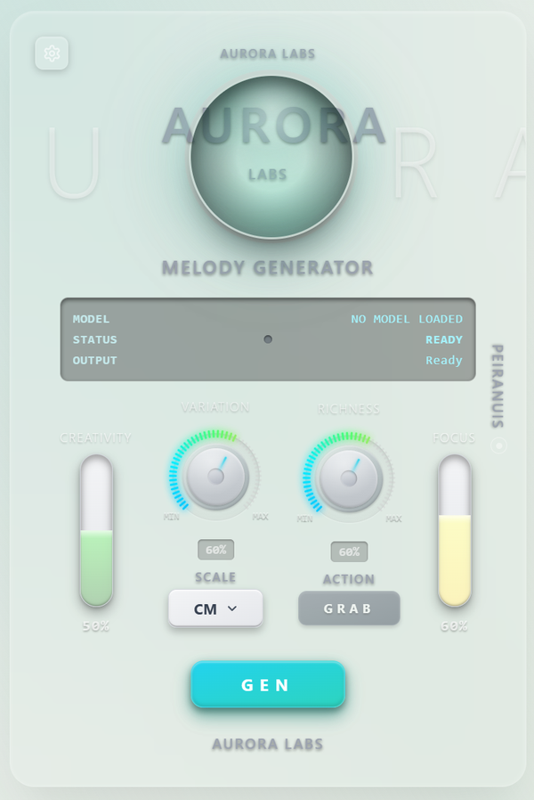
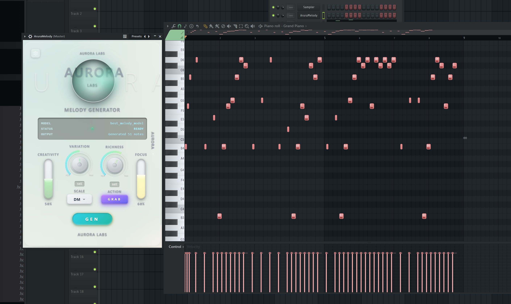

# 🌟 AURORA BACKEND

**Aurora Labs' revolutionary AI music generation platform. Professional VST plugin for seamless DAW integration, advanced MIDI model management, and real-time music creation.**

[](https://www.python.org/downloads/)
[](https://fastapi.tiangolo.com/)
[](LICENSE)

##  Plugin Interface



##  Inside DAW Integration



##  Aurora Backend Features

###  Core Capabilities
- **Advanced AI Model Management**: Sophisticated melody, harmony, and rhythm generation
- **Real-time MIDI Processing**: Lightning-fast generation for live performance
- **Professional DAW Integration**: Native support for FL Studio, Ableton Live, Logic Pro
- **Dynamic Model Registry**: Hot-swap models without restarting services

### ⚙️ Configuration & Control
- **YAML-based Configuration**: Centralized model and parameter management
- **Flexible Input Handling**: Support for MIDI files, note sequences, and tokenized inputs
- **Custom Generation Profiles**: Preset configurations for different musical styles
- **Plugin Parameter Mapping**: Direct integration with VST plugin interfaces

##  Aurora Use Cases

### 1. **Professional VST Plugin Integration**
- Native integration with major DAWs (FL Studio, Ableton Live, Logic Pro)
- Direct piano roll manipulation with AI-generated melodies
- Real-time parameter control for creative expression
- Seamless workflow integration with existing production pipelines

### 2. **Real-time Live Performance**
- Generate musical ideas on-the-fly during live performances
- MIDI streaming directly to your DAW for immediate playback


##  Quick Start

Get Aurora up and running in 3 simple steps:

### Step 1: Run Setup Script

**Windows:**
```bash
setup.bat
```

**Linux/Mac:**
```bash
chmod +x setup.sh
./setup.sh
```

**What the setup script does:**
1. Checks Python 3.9+ and Git are installed
2. Downloads AI models from Hugging Face (~2.5 GB)
   - `melody_model.safetensors` → placed in `models/` folder
   - `melody_model_config.json` → placed in `models/` folder  
   - `alv_tokenizer-2.0.1-py3-none-any.whl` → placed in `models/` folder
3. Installs the tokenizer wheel file first
4. Installs other dependencies (FastAPI, Uvicorn, etc.)
5. Shows PyTorch installation commands (you choose GPU/CPU)

### Step 2: Install PyTorch

After setup completes, install PyTorch based on your hardware:

**For NVIDIA GPU (CUDA):**
```bash
# Windows/Linux
python -m pip install torch torchvision torchaudio --index-url https://download.pytorch.org/whl/cu124

# Check CUDA version first: nvidia-smi
# For CUDA 12.1, use: --index-url https://download.pytorch.org/whl/cu121
```

**For CPU Only (slower):**
```bash
python -m pip install torch torchvision torchaudio
```

**For macOS:**
```bash
python3 -m pip install torch torchvision torchaudio
```

### Step 3: Start the Server

```bash
# Windows
python main.py

# Linux/Mac
python3 main.py
```

Open http://localhost:8000/docs to see the API documentation and test generation!

---

##  Detailed Installation Guide

### Prerequisites
- **Python 3.9+** - Required for backend server
- **Git** - For downloading models from Hugging Face
- **8GB+ RAM** - For model loading
- **GPU with CUDA** (Optional but recommended) - 10-50x faster inference
- **~5GB free disk space** - For models and dependencies

###  What Happens During Setup

The setup script automates these steps:

1. **Validation**: Checks Python 3.9+ and Git are installed
2. **Directory Creation**: Creates `models/`, `logs/`, and `temp/` folders
3. **Model Download**: Clones https://huggingface.co/alvanalrakib/Aurora-Labs
4. **File Organization**:
   - Copies `melody_model.safetensors` to `models/` (2.35 GB)
   - Copies `melody_model_config.json` to `models/` (326 bytes)
   - Copies `alv_tokenizer-2.0.1-py3-none-any.whl` to `models/` (19.7 KB)
5. **Tokenizer Installation**: Installs the wheel file from `models/` folder
6. **Dependencies**: Installs packages from `requirements.txt`
7. **PyTorch Prompt**: Shows install commands for your system

###  Manual Installation (If Automated Script Fails)

```bash
# 1. Create folders
mkdir models logs temp

# 2. Download models from Hugging Face
git clone https://huggingface.co/alvanalrakib/Aurora-Labs temp/hf-download
cp temp/hf-download/melody_model.safetensors models/
cp temp/hf-download/melody_model_config.json models/
cp temp/hf-download/alv_tokenizer-2.0.1-py3-none-any.whl models/

# 3. Install tokenizer first
pip install models/alv_tokenizer-2.0.1-py3-none-any.whl

# 4. Install dependencies
pip install -r requirements.txt

# 5. Install PyTorch (choose one)
# For GPU: pip install torch torchvision torchaudio --index-url https://download.pytorch.org/whl/cu118
# For CPU: pip install torch torchvision torchaudio

# 6. Cleanup
rm -rf temp/hf-download
```

###  VST Plugin Installation

#### Install Aurora VST Plugin
1. Copy the `Assets/AruraMelody.vst3` file to your VST3 directory:
   - **Windows**: `C:\Program Files\Common Files\VST3\`
   - **macOS**: `/Library/Audio/Plug-Ins/VST3/` or `~/Library/Audio/Plug-Ins/VST3/`
   - **Linux**: `/usr/lib/vst3/` or `~/.vst3/`

#### First Time Setup in Your DAW
1. Launch your DAW (FL Studio, Ableton Live, Logic Pro, etc.)
2. Scan for new plugins (refer to your DAW's plugin management)
3. Locate "AruraMelody" in your VST plugin list
4. Drag AruraMelody onto a MIDI track or instrument slot
5. Start generating AI-powered melodies!

###  Starting the Server

After installation, start the Aurora backend server:

```bash
# Start the server
python main.py

# Or use the start script
python start_server.py

# With custom configuration
python main.py --config config/models.yaml --port 8000
```

The API will be available at:
- **API Docs**: http://localhost:8000/docs
- **ReDoc**: http://localhost:8000/redoc
- **API Endpoint**: http://localhost:8000/api/v1/

###  Model Configuration
```yaml
# Aurora automatically creates this configuration file
# Usually located at: ~/Documents/Aurora/models.yaml

aurora:
  version: "2.0.0"
  models_path: "./models"  # Path to your Aurora AI models

models:
  aurora_melody_v2:
    enabled: true
    priority: 1  # Higher priority models load first

  aurora_harmony:
    enabled: true
    priority: 2
```

### ✅ Verify Installation

Check everything is working:

```bash
# Check PyTorch
python -c "import torch; print('PyTorch:', torch.__version__); print('CUDA:', torch.cuda.is_available())"

# Check tokenizer
python -c "import alv_tokenizer; print('Tokenizer: OK')"

# Check model files (should show ~2.35 GB file)
ls -lh models/                    # Linux/Mac
dir models\                       # Windows
```

Expected files in `models/` folder:
- `melody_model.safetensors` (2.35 GB)
- `melody_model_config.json` (326 bytes)
- `alv_tokenizer-2.0.1-py3-none-any.whl` (19.7 KB)

### System Requirements

#### Minimum Requirements
- **CPU**: Multi-core processor (Intel i5/AMD Ryzen 5 or better)
- **RAM**: 8GB (model loading + inference)
- **Storage**: 5GB free space (models + dependencies)
- **OS**: Windows 10+, macOS 10.14+, Ubuntu 18.04+

#### Recommended Requirements
- **CPU**: Intel i7/AMD Ryzen 7 or better
- **GPU**: NVIDIA GPU with 4GB+ VRAM (GTX 1060 or better)
- **RAM**: 16GB (for multiple models and large sequences)
- **Storage**: 10GB+ free space
- **CUDA**: 11.8 or 12.1

## ⚙️ Aurora Configuration

### Plugin Settings
Aurora's interface provides intuitive controls for all generation parameters:

- **Model Selection**: Choose from different Aurora AI models from settings page
- **Style Presets**: Pre-configured settings for various musical genres
- **Generation Controls**: Temperature, creativity, and complexity sliders

### Model Management
Aurora automatically manages model loading and switching:

- **Smart Loading**: Models load on-demand to optimize memory usage
- **Background Updates**: New models can be added without restarting
- **Quality Settings**: Adjust model complexity based on your hardware
- **Offline Mode**: Work without internet connectivity once models are downloaded


## Aurora Troubleshooting

### Common Issues & Solutions

**Setup Script Fails:**
- Ensure Python 3.9+ and Git are installed and in PATH
- Check internet connection for Hugging Face download (~2.5 GB)
- Try manual installation steps if automated script fails
- Windows: Run as Administrator if permission errors occur

**"No module named torch" Error:**
- PyTorch not installed - it's a separate step after setup
- For GPU: `pip install torch torchvision torchaudio --index-url https://download.pytorch.org/whl/cu118`
- For CPU: `pip install torch torchvision torchaudio`

**"No module named alv_tokenizer" Error:**
- Setup script didn't complete successfully
- Manually install: `pip install models/alv_tokenizer-2.0.1-py3-none-any.whl`
- Or download from: https://huggingface.co/alvanalrakib/Aurora-Labs

**Model Files Not Found:**
- Setup script didn't download models successfully
- Check `models/` folder exists and contains 2.35 GB `.safetensors` file
- Re-run setup script or use manual installation commands

**Server Won't Start:**
- Check if port 8000 is already in use
- Verify config/models.yaml exists and is valid
- Check logs/api.log for detailed error messages
- Ensure all dependencies are installed: `pip install -r requirements.txt`

**Plugin Not Recognized by DAW:**
- Ensure Aurora VST plugin is installed in the correct VST directory
- Restart your DAW after installation
- Rescan plugins in your DAW settings
- Check that you have the correct VST version (VST3 recommended)

### 📞 Aurora Support

- **Bug Reports**: [GitHub Issues](https://github.com/WebChatAppAi/Aurora-Labs/issues)
- **Community Discussions**: [GitHub Discussions](https://github.com/WebChatAppAi/Aurora-Labs/discussions)
- **Support**: support@auroralabs.ai
- ** Feature Requests**: Use GitHub Issues with `enhancement` label

## 📁 Project Structure

```
Aurora-Backend/
├── setup.bat                          # Windows automated setup
├── setup.sh                           # Linux/Mac automated setup
├── main.py                            # Server entry point
├── requirements.txt                   # Python dependencies
├── config/
│   └── models.yaml                   # Configuration
├── models/                           # Downloaded by setup script
│   ├── melody_model.safetensors      # AI model (2.35 GB)
│   ├── melody_model_config.json      # Model config
│   └── alv_tokenizer-2.0.1-py3-none-any.whl  # Tokenizer
├── app/
│   ├── api/endpoints.py              # API routes
│   ├── core/config.py                # Config manager
│   ├── models/                       # Model classes
│   ├── schemas/                      # Request/Response schemas
│   ├── services/model_registry.py    # Model loading
│   └── utils/                        # Helper functions
├── Assets/
│   └── AruraMelody.vst3              # VST plugin
└── logs/                             # Application logs
```

## 📄 License

Aurora Backend is licensed under the MIT License - see the [LICENSE](LICENSE) file for details.

## 🙏 Acknowledgments

### 🎵 Aurora Technology Stack
- **AI Architecture**: Custom transformer models trained on diverse musical datasets
- **Audio Processing**: Advanced MIDI manipulation and real-time synthesis
- **Plugin Framework**: Native integration with VST3, AU, and AAX formats
- **Deep Learning**: Powered by PyTorch and cutting-edge AI research

### 🏗️ Built With
- **[PyTorch](https://pytorch.org/)** - Deep learning framework powering Aurora AI
- **[MIDO](https://mido.readthedocs.io/)** - MIDI file processing library
- **[NumPy](https://numpy.org/)** - Scientific computing and array operations
- **[CUDA](https://developer.nvidia.com/cuda-toolkit)** - GPU acceleration for AI inference

### 🌟 Special Thanks
- **Aurora Labs Team**: For pioneering AI-driven music creation
- **Music Production Community**: For feedback and inspiration
- **Open Source Community**: For the incredible tools that power Aurora
- **Research Community**: For advancing the field of AI music generation

---

<div align="center">

**🎼 Aurora Backend - Revolutionizing Music Creation with AI**

*Made with ❤️ by [Aurora Labs](https://github.com/WebChatAppAi/Aurora-Labs) for the creative community*

[](https://github.com/WebChatAppAi/Aurora-Labs)
[](https://twitter.com/auroralabs)

</div>